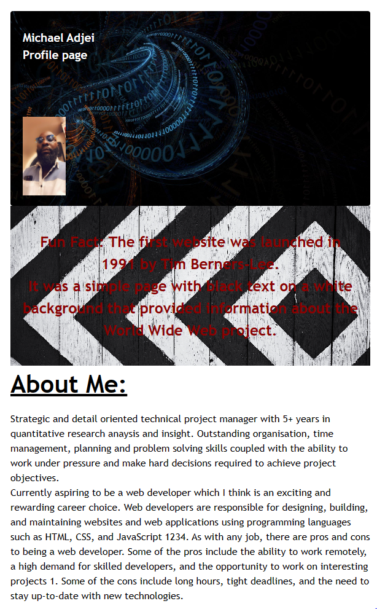

# Michaels-Portfolio

## Description

A well-structured portfolio serves as a powerful tool for potential employers, whether you're seeking part-time or full-time positions. An effective portfolio not only showcases my best work but also provides insights into my creative and problem-solving processes. Having multiple live projects is often a prerequisite for securing an initial interview at many companies. With these considerations in mind, this challenge was an opportunity to apply the fundamental skills I've recently acquired, such as flexbox, media queries, and CSS variables. I've not only gained hands-on experience but also created a valuable asset to aid in my future job search. 

## Installation

Plan Website:
Before coding, website's structure, layout, and content was planned. e.g Decide on the number of pages, the navigation menu, and the overall design.

Created HTML Structure:
Using Visual Studio Code

Add Content:
Added my content inside the body. Include headings, paragraphs, images, links, and more. Using HTML tags to structure my content.

Create a CSS File:
Saved with a .css extension, like "style.css." Linked this file to my HTML document.

Style Website:
Define styles for my HTML elements. Using selectors to target specific elements and apply styles like colors, fonts, margins, and more.

Design Layout:
Used CSS to control the layout of my website. Techniques like floating, positioning, and flexbox to arrange elements on the page.

Add Navigation:
Created a navigation menu and styled it with CSS. Link items to external sites.

Test and Debug:
Periodically tested my website in different browsers to ensure it displays correctly. Debug any issues that arise during testing.

Responsive Design:
Made my website responsive by using media queries in your CSS. This ensures your site adapts to various screen sizes, like mobile devices and tablets.

Optimize Images:
Optimize images used to improve loading times. Alt attribute for image tags to provide alternative text.

Cross-Browser Compatibility:
Tested website in multiple browsers (e.g., Chrome, Firefox, Safari, Edge) to ensure it works well everywhere.

Publish Your Website:
Once satisfied with website, it was deployed.

## Usage

A portfolio of work showcased using skills and talents learned from the bootcamp. Website would be improved as more knowledge is gained.

## Credits

https://stackoverflow.com/, https://dev.to/ https://www.w3schools.com/

## License

Please find licence in the folder
